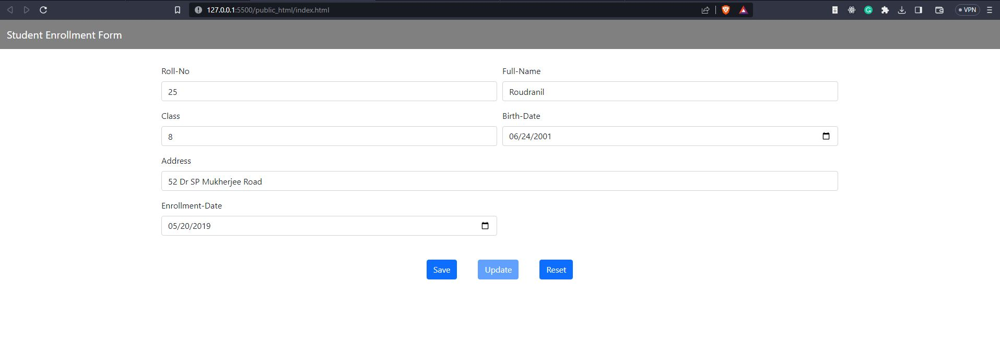
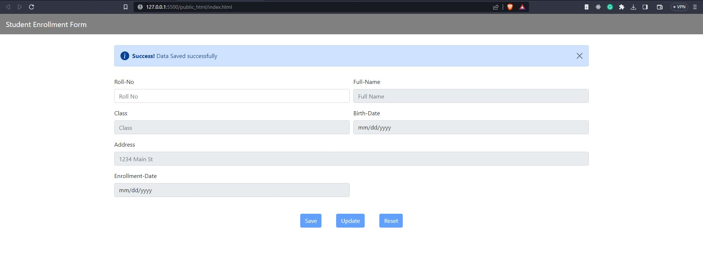
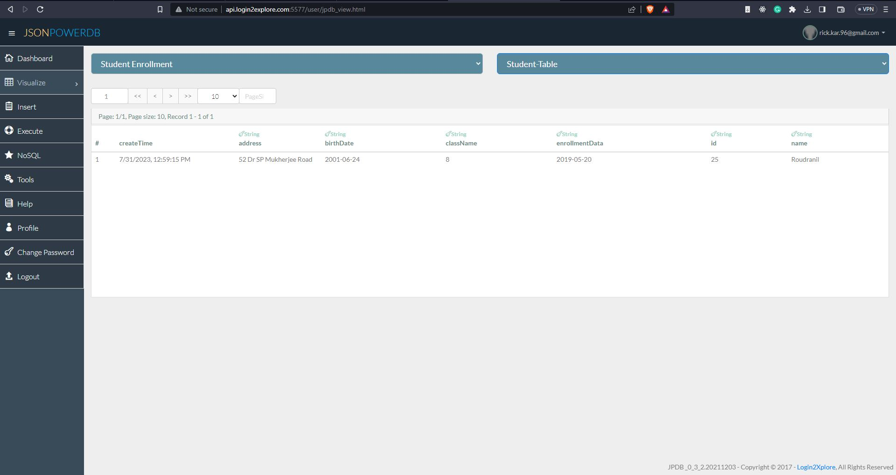
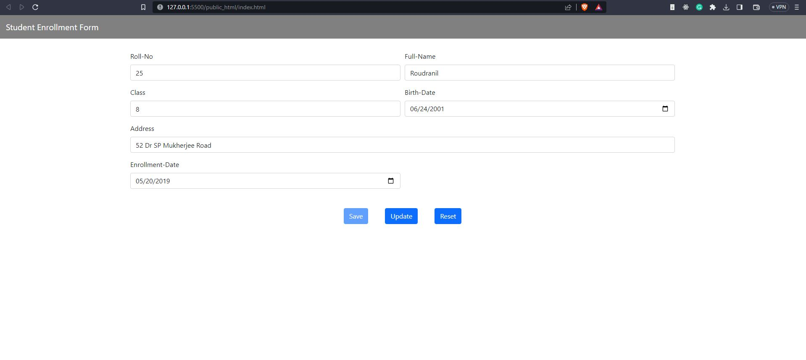
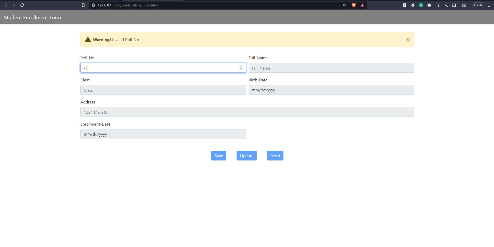

# Student-Enrollment-Form
## Description 
This is a web-based HTML form for student enrollment using JsonPowerDB as Database 
JsonPowerDB is used to perform CRUD operation 

# Benefits of using JsonPowerDB
* Nimble, simple to use, in memory, real-time.
* Schema free - easy to maintain.
* Serverless support - fast development - cuts time to market.
* Built around the world's fastest indexing engine PowerIndex.
* Webservices API - Low Dev Cost.
* Multiple Security Layers.
* A single instance - Million Indexes

# TECH STACKS
* HTML
* Bootstrap
* JAVASCRIPT 
* JsonPowerDB

# Illustrations:
* **UPDATE**: when the student roll number is already present in the database then student information is fetched from the database and filled in the respective field then the user can UPDATE student information 
* **SAVE**: If the student roll number does not exist in the database then we can fill in other fields and save it in the database
* **RESET**: By this, we can clear all field of the form, and with this, except the first field (roll-no) other fields are disabled until the user enter any roll number
* **Alert**: This website uses disposable Alter prompt using Bootstrap

# Sources
* Introduction to JsonPowerDB - V2.0 course  on https://careers.login2explore.com/
* [Bootstrap](https://getbootstrap.com/docs/5.0/getting-started/introduction/)

# HOW TO USE
**Initially**

We need to enter a roll number, name, birth date, and all the details and click the save 

**The data is stored in the database which is as shown:**

**The update button is shown for already existing data**

**If input data is not valid**

